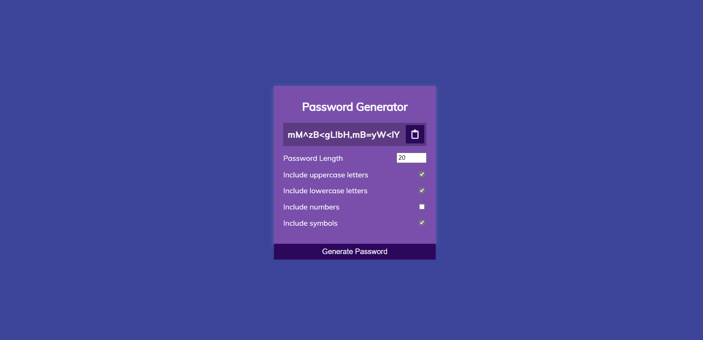

# Password-Generator-Web-application
<h1>Password Generator Web App</h1>

Password Generator Web App written in HTML, CSS, and JavaScript .

### Use of the Project:

This web app helps to create strong random passwords using symbols,numbers,uppercase and lowercase characters and can generate passwords of any length which can easily be used during authentication.

<h3>Used Technologies</h3>
<ul>
  <li>HTML5</li>
  <li>CSS3</li>
  <li>JavaScript</li>
</ul>

<h3> Screenshots </h3>

 
